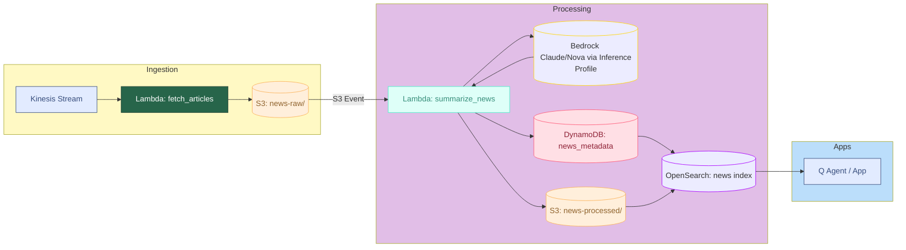

# NewsInsight.ai 

## Technical Project Summary

Pipeline that ingests news from two sources (NewsAPI + The Guardian), stores raw JSON in S3, triggers a summarizer Lambda that calls Amazon Bedrock to produce a summary, sentiment, and entities, writes processed JSON back to S3, and saves structured fields to DynamoDB for downstream search/indexing (OpenSearch) and Q&A agent.

## AWS Components (As per Hackathon Requirement)


- S3

    - newsinsights-raw-<acct>-<region> → news-raw/ (raw articles)

    - newsinsights-processed-<acct>-<region> → news-processed/ (summaries)

- Lambda

    - newsinsights-fetch-articles (pulls NewsAPI + Guardian, writes raw)

    - newsinsights-summarize-news (S3 event → Bedrock → processed + DynamoDB)

- Bedrock

    - Inference Profile (Anthropic Claude)

    - SSM param /newsinsights/BEDROCK_MODEL_ID points to profile ARN

- DynamoDB

    - Table news_metadata (id, source, date, summary, sentiment, verification_score)

- OpenSearch index + Q Agent

## 🧭 System Architecture


## Setup
0) Prereqs

- AWS CLI configured (aws configure --profile newsinsights)

- Region: us-west-2 (used throughout)

- Git repo: NewsInsight.ai

1) Environment variables (PowerShell)
```
$Profile="newsinsights"
$Reg  = aws configure get region --profile $Profile
$Acct = aws sts get-caller-identity --query Account --output text --profile $Profile
$RAW  = "newsinsights-raw-$Acct-$Reg"
$PROC = "newsinsights-processed-$Acct-$Reg"
```

2) S3 buckets
```
aws s3api create-bucket --bucket $RAW  --region $Reg --create-bucket-configuration LocationConstraint=$Reg --profile $Profile
aws s3api create-bucket --bucket $PROC --region $Reg --create-bucket-configuration LocationConstraint=$Reg --profile $Profile
aws s3 cp .\.keep "s3://$RAW/news-raw/.keep"  --profile $Profile
aws s3 cp .\.keep "s3://$PROC/news-processed/.keep" --profile $Profile
```
3) DynamoDB
```
aws dynamodb create-table --table-name news_metadata `
  --attribute-definitions AttributeName=id,AttributeType=S `
  --key-schema AttributeName=id,KeyType=HASH `
  --billing-mode PAY_PER_REQUEST --profile $Profile
aws dynamodb wait table-exists --table-name news_metadata --profile $Profile
```
4) IAM role for Lambdas
```
# Create role (trust policy for Lambda)
@'
{
  "Version":"2012-10-17",
  "Statement":[{"Effect":"Allow","Principal":{"Service":"lambda.amazonaws.com"},"Action":"sts:AssumeRole"}]
}
'@ | Set-Content -Path .\trust.json -NoNewline

aws iam create-role --role-name newsinsights-lambda-role --assume-role-policy-document file://trust.json --profile $Profile

# Basic + S3 + SSM + Bedrock
aws iam attach-role-policy --role-name newsinsights-lambda-role --policy-arn arn:aws:iam::aws:policy/service-role/AWSLambdaBasicExecutionRole --profile $Profile

# Inline resource policy (replace placeholders automatically)
@'
{
  "Version":"2012-10-17",
  "Statement":[
    {"Effect":"Allow","Action":["s3:GetObject","s3:ListBucket"],"Resource":["arn:aws:s3:::__RAW__","arn:aws:s3:::__RAW__/*"]},
    {"Effect":"Allow","Action":["s3:PutObject","s3:ListBucket"],"Resource":["arn:aws:s3:::__PROC__","arn:aws:s3:::__PROC__/*"]},
    {"Effect":"Allow","Action":["ssm:GetParameter"],"Resource":["arn:aws:ssm:__REG__:__ACCT__:parameter/newsinsights/*"]},
    {"Effect":"Allow","Action":["bedrock:InvokeModel","bedrock:InvokeModelWithResponseStream"],"Resource":"*"},
    {"Effect":"Allow","Action":["dynamodb:PutItem","dynamodb:DescribeTable"],"Resource":"arn:aws:dynamodb:__REG__:__ACCT__:table/news_metadata"}
  ]
}
'@ | Set-Content -Path .\lambda-inline.template.json -NoNewline
(Get-Content .\lambda-inline.template.json) -replace '__RAW__',$RAW -replace '__PROC__',$PROC -replace '__REG__',$Reg -replace '__ACCT__',$Acct | Set-Content .\lambda-inline.json
aws iam put-role-policy --role-name newsinsights-lambda-role --policy-name newsinsights-inline --policy-document file://lambda-inline.json --profile $Profile
```

If using Anthropic, some accounts also require Marketplace rights:
```
aws iam attach-role-policy --role-name newsinsights-lambda-role --policy-arn arn:aws:iam::aws:policy/AWSMarketplaceManageSubscriptions --profile $Profile
```
5) SSM parameters (API keys + model)
```
aws ssm put-parameter --name /newsinsights/NewsAPI_API_KEY --type SecureString --value "<newsapi-key>" --overwrite --profile $Profile
aws ssm put-parameter --name /newsinsights/GUARDIAN_API_KEY --type SecureString --value "<guardian-key>" --overwrite --profile $Profile

# Bedrock: store an Inference Profile ARN (Anthropic or Amazon)
aws ssm put-parameter --name /newsinsights/BEDROCK_MODEL_ID --type String --value "<inference-profile-arn>" --overwrite --profile $Profile

```

6) Deploy Lambdas

```
# fetch_articles (Python 3.11) → writes raw JSON to $RAW/news-raw/
Compress-Archive -Path .\fetch_articles_lambda.py -DestinationPath .\fetch_articles.zip -Force
$RoleArn = aws iam get-role --role-name newsinsights-lambda-role --query Role.Arn --output text --profile $Profile

aws lambda create-function --function-name newsinsights-fetch-articles `
  --runtime python3.11 `
  --handler fetch_articles_lambda.handler `
  --role $RoleArn `
  --timeout 60 --memory-size 512 `
  --zip-file fileb://fetch_articles.zip `
  --environment "Variables={RAW_BUCKET=$RAW,GUARDIAN_PARAM=/newsinsights/GUARDIAN_API_KEY,NEWSAPI_PARAM=/newsinsights/NewsAPI_API_KEY}" `
  --profile $Profile

# summarize_news (Python 3.11) → Bedrock + DynamoDB + processed S3
Compress-Archive -Path .\lambdas\summarize_news\* -DestinationPath .\summarize_news.zip -Force

aws lambda create-function --function-name newsinsights-summarize-news `
  --runtime python3.11 `
  --handler app.handler `
  --role $RoleArn `
  --timeout 60 --memory-size 1024 `
  --zip-file fileb://summarize_news.zip `
  --environment "Variables={RAW_BUCKET=$RAW,PROCESSED_BUCKET=$PROC,BEDROCK_MODEL_ID_PARAM=/newsinsights/BEDROCK_MODEL_ID,MODEL_FAMILY=anthropic,TABLE_NAME=news_metadata}" `
  --profile $Profile
```

7) S3 → Lambda notification

```
aws lambda add-permission --function-name newsinsights-summarize-news --statement-id s3invoke `
  --action lambda:InvokeFunction --principal s3.amazonaws.com --source-arn "arn:aws:s3:::$RAW" --profile $Profile

@"
{
  "LambdaFunctionConfigurations": [
    {
      "LambdaFunctionArn": "$(aws lambda get-function --function-name newsinsights-summarize-news --query Configuration.FunctionArn --output text --profile $Profile)",
      "Events": ["s3:ObjectCreated:Put"],
      "Filter": { "Key": { "FilterRules": [ { "Name": "prefix", "Value": "news-raw/" } ] } }
    }
  ]
}
"@ | Set-Content -Path .\s3notif.json -NoNewline

aws s3api put-bucket-notification-configuration --bucket $RAW --notification-configuration file://s3notif.json --profile $Profile

```

8) Smoke test

```
aws lambda invoke --function-name newsinsights-fetch-articles out_fetch.json --profile $Profile | Out-Null
aws s3 ls "s3://$RAW/news-raw/" --recursive --profile $Profile | Select-Object -First 5

# Manually trigger summarizer once (optional)
# Build s3_event.json with an existing raw key and invoke; expect {"status":"ok"} and a file in news-processed/

```


## Repo layout (Day 1)

NewsInsight.ai/
  fetch_articles_lambda.py          ← used for ingestion
  lambdas/
    summarize_news/
      app.py                        ← summarizer (Bedrock + DDB)
  scripts/
    test_query.py
  README.md